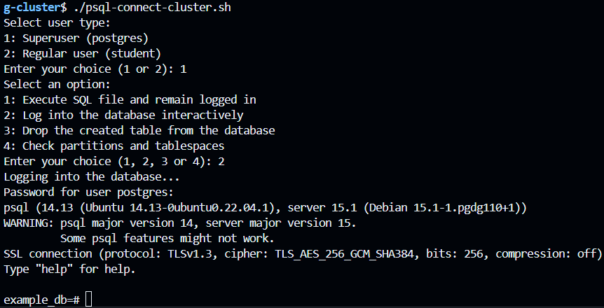
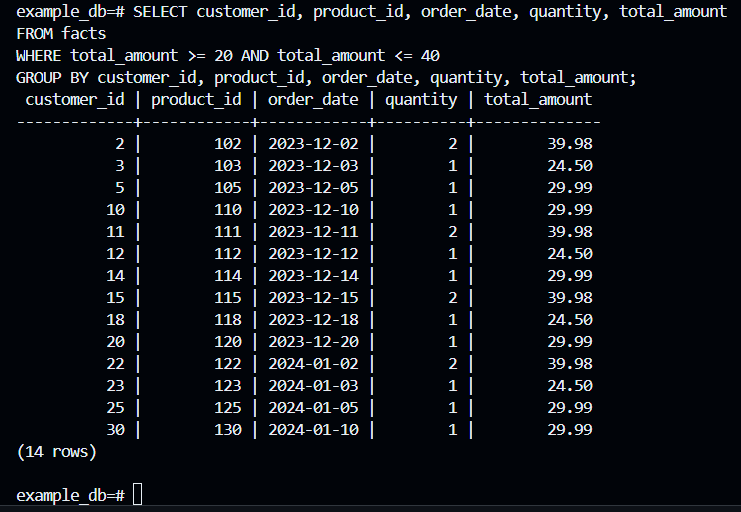
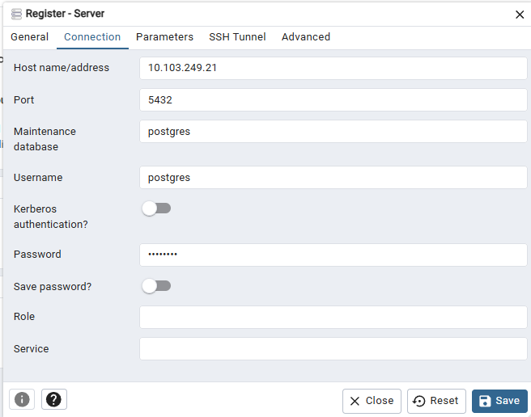
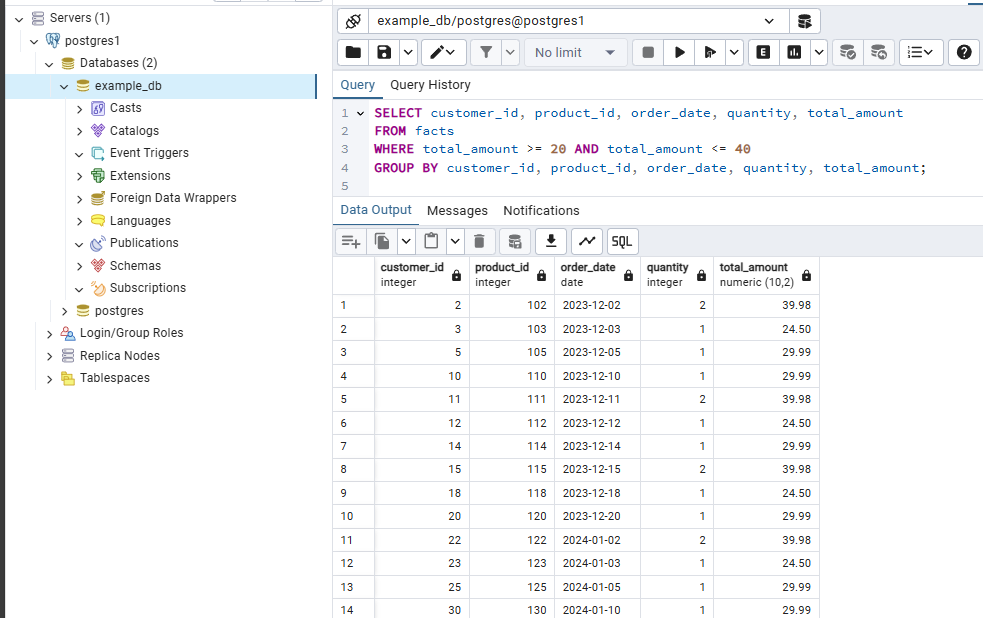

# Installing the CNPG PostgreSQL Operator and CNPG Cluster in K8s

This guide provides instructions to deploy a PostgreSQL cluster on Kubernetes using the CNPG Operator. Follow these steps in the specified order for a successful setup.

## Prerequisites

- Kubernetes cluster is set up and accessible
- `kubectl` installed and configured
- Helm installed 

## Setup Steps
1. **Make All Required .sh Files Executable**

   Set the permissions for each script to ensure they are executable.
   ```bash
   source variables.sh
   sudo chmod +x install-prerequisties/install-local-path-provisioner.sh
   sudo chmod +x install-prerequisties/install-psql-client.sh
   sudo chmod +x ./cnpg-operator/install-helm-cnpg-operator.sh
   sudo chmod +x ./cnpg-operator/uninstall-helm-cnpg-operator.sh
   sudo chmod +x ns-cnpg-cluster-create.sh 
   sudo chmod +x create-certs-and-secrets.sh 
   sudo chmod +x run-cnpg-cluster.sh 
   sudo chmod +x psql-connect-cluster.sh 
   sudo chmod +x deploy-pgadmin4.sh
   sudo chmod +x enable-podmonitor-cnpg-cluster.sh
   sudo chmod +x disable-podmonitor-cnpg-cluster.sh
   sudo chmod +x ./cloud-native-pg-observability/kube-prometheus-stack/install-kube-prometheus-stack-helm.sh
   sudo chmod +x cleanup-cnpg-cluster.sh 
   ```
2. **Install Local Path Provisioner**
```bash
./install-prerequisties/install-local-path-provisioner.sh
```
3. **Install psql client**
```bash
./install-prerequisties/install-psql-client.sh
```

## Run scenario

Now, run each script in the specified order to complete the setup.

### Step 1: Create namespace for cnpg cluster
```bash
./ns-cnpg-cluster-create.sh 
```
### Step 2: Install CNPG Operator using Helm
```bash
./cnpg-operator/install-helm-cnpg-operator.sh
```

### Step 3: Create certificates and secrets for the PostgreSQL cluster.
```bash
./create-certs-and-secrets.sh
```

### Step 4: Deploy the PostgreSQL cluster using the CNPG Operator.
``` bash
./run-cnpg-cluster.sh
```

### Step 5: Connect to the PostgreSQL cluster.
The psql-connect-cluster.sh script helps you connect to the PostgreSQL cluster in different modes. Follow these steps:

#### Run the Script
```bash
./psql-connect-cluster.sh
```
#### Choose a User Type

After starting the script, you’ll be prompted to select a user type:

- **1**: Superuser (postgres) &nbsp;&nbsp;⇨&nbsp;&nbsp; login: `postgres`, password: `admin123`
- **2**: Regular user (student) &nbsp;&nbsp;⇨&nbsp;&nbsp; login: `student`, password: `student`

#### Select an Action
Once the user type is selected, you’ll see the following options:

- **Option 1**: Execute a predefined SQL file (`init.sql`) and remain logged into the database afterward.
- **Option 2**: Log into the database interactively to execute commands manually.
- **Option 3**: Drop the specified tables from the database.
- **Option 4**: Check existing partitions and tablespaces.

Let's log into postgreSQL DB through psql and do some queries in postgresql connecting through psql:





### Step 6: Configure PGAdmin - GUI for PostgreSQL DB

#### Execute the following bash script. It runs secret,deployment,service resources required to launch pgadmin4 web application
```bash
./deploy-pgadmin4.sh
```
#### Access PGAdmin4 Web Application:

##### Set the IP and Port for PGAdmin4 - PostgreSQL GUI Web App:
```bash
export IP_PGADMIN4=$(kubectl get nodes master -ojsonpath='{.status.addresses[0].address}')
export PORT_PGADMIN4=$(kubectl get svc/pgadmin -n $NS_CLUSTER -ojsonpath='{.spec.ports[0].nodePort}')
echo $IP_PGADMIN4:$PORT_PGADMIN4
```
##### Open PGAdmin4 App in your browser:
Type the following in your web browser: 
```bash
http://$IP_PGADMIN4:$PORT_PGADMIN4/
```
Replace <IP_PGADMIN4> and <PORT_PGADMIN4> with the values you obtained from the commands above.

When you are on pgadmin4 website, then firstly you have to register your server. Type the following data:
- Hostname/address=Cluster IP address of postgres service with read-write methods

```bash
postgres1-rw   ClusterIP   10.103.249.21    <none>        5432/TCP       4h2m   cnpg.io/cluster=postgres1,cnpg.io/instanceRole=primary
```
- Username/login: Superuser: postgres ; Basicuser: student
- Password: Superuser: admin123 ; Basicuser: student



Let's execute some queries:



### Step 7: Configure Observability for CNPG Cluster (optional)
#### Install Prometheus and Grafana using Helm
```bash
./cloud-native-pg-observability/kube-prometheus-stack/install-kube-prometheus-stack-helm.sh
```
#### Enable Pod Monitor for Existing CNPG Cluster and configure Prometheus so as to scrape metrics from specific Pod Monitor
```bash
./enable-podmonitor-cnpg-cluster.sh
```
#### Access the Prometheus Web Application

##### Set the IP and Port for Prometheus:
```bash
export IP_PROM=$(kubectl get nodes master -ojsonpath='{.status.addresses[0].address}')
export PORT_PROM=$(kubectl get svc/prometheus-kube-prometheus-prometheus -n prometheus-system -ojsonpath='{.spec.ports[0].nodePort}')
```
##### Open Prometheus in Your Web Browser:
Type the following in your web browser: 
```bash
http://$IP_PROM:$PORT_PROM
```
Replace <IP_PROM> and <PORT_PROM> with the values you obtained from the commands above.

#### Access the Grafana Web Application

##### Set the IP and Port for Grafana:
```bash
export IP_GRAFANA=$(kubectl get nodes master -ojsonpath='{.status.addresses[0].address}')
export PORT_GRAFANA=$(kubectl get svc/prometheus-grafana -n prometheus-system -ojsonpath='{.spec.ports[0].nodePort}')
```

##### Open Grafana in Your Web Browser:
Type the following in your web browser: 
```bash
http://$IP_GRAFANA:$PORT_GRAFANA
```
Replace <IP_GRAFANA> and <PORT_GRAFANA> with the values you obtained from the commands above.

##### Obtain credentials to log into Grafana:
```bash
kubectl get secret prometheus-grafana -n prometheus-system -o jsonpath='{.data.admin-user}' | base64 --decode #<- get login for grafana
kubectl get secret prometheus-grafana -n prometheus-system -o jsonpath='{.data.admin-password}' | base64 --decode #<- get pwd for grafana
```

To set up monitoring for your CNPG (Cloud Native PostgreSQL) cluster, follow these steps to import a preconfigured Grafana dashboard. By default, Prometheus is set as the data source in Grafana, but to visualize CNPG metrics, you'll need to import the specific Grafana dashboard configuration provided.
- **1.** In your Grafana Web Application, go to Import Dashboard.
- **2.** Import JSON file from the following path:
```bash
cloud-native-pg-observability/grafana-dashboard.json
```

### Step 8: Clean up the cluster resources (optional)
```bash
./cleanup-cnpg-cluster.sh
```
### Step 9: Uninstall CNPG Operator (optional)
```bash
./cnpg-operator/uninstall-helm-cnpg-operator.sh
```
